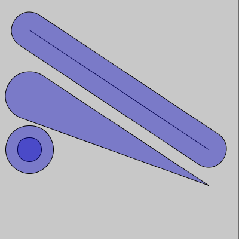

#  Arc, tangents & Bezier studies


> from sketch-a-day project, [sketch_2020_09_26a](https://github.com/villares/sketch-a-day/tree/master/2020/sketch_2020_09_26a)

These repository contains the product of my studies trying to work with arcs, bezier approximations of arcs, with Processing Java, p5js, but mostly with Processing Python mode and py5 (http://py5.ixora.io).

I have added very little new ideas here, most of my findings & previous studies were moved into the `PRIOR_ART` folder, I tried to attribute stuff with links. Please note that the most recent (and maybe unstable?) version of the Python functions shown here are kept at this other repository: [github.com/villares/villares](https://raw.githubusercontent.com/villares/villares/master/arcs.py). You will probably want to get [`arcs.py`](https://raw.githubusercontent.com/villares/villares/master/arcs.py) and [`line_geometry.py`](https://raw.githubusercontent.com/villares/villares/master/line_geometry.py) it depends on.

### Bezier approximation of an arc

Processing *PShape* insfrastructure does not contain a fuction for embeding an arc in a larger polyline shape. The `b_arc` function provided here can be used inside `beginShape()`/`endShape()` as a kind of "arcVertex" (which doesn't exist). It follows mostly the Processing `arc` signature, but does not include PIE and CHORD modes. You can find demos at:

  - [`b_arc`](/villares_bezier_arc_aproximation/villares_bezier_arc_aproximation.pyde) Processing Python mode (also works with [pyp5js](berinhard.github.io/pyp5js) and [py5](http://py5.pixora.io))
  - [`b_arc`](/villares_bezier_arc_aproximation_java/villares_bezier_arc_aproximation_java.pde) Processing Java 
  - [`b_arc`](/villares_bezier_arc_aproximation_p5js/villares_bezier_arc_aproximation_p5js.js) p5.js

   > 
   > ```python
   > x, y, w, h, start_angle, end_angle = 75, 100, 100, 100, 0, PI + QUARTER_PI
   > # Standalone arc replacement
   > b_arc(x, y, w, h, start_angle, end_angle)
   >
   > # mode=2 for use inside beginShape/endShape
   > x += 125
   > beginShape()
   > b_arc(x, y, w, h, start_angle, end_angle, mode=2) 
   > endShape(CLOSE)
   > x += 125
   > beginShape()
   > b_arc(x, y, w, h, start_angle, end_angle, mode=2)
   > vertex(x, y)
   > endShape(CLOSE)
   > ```

### More arcs and tangents

More stuff based on `b_arc`, code kept at [`arcs.py`](https://raw.githubusercontent.com/villares/villares/master/arcs.py), that gets some functions from [`line_geometry.py`](https://raw.githubusercontent.com/villares/villares/master/line_geometry.py)). Most functions can also be used with `p_arc`(a polygonal approximation of an arc). Except were noted, mostly Processing Python mode functions, as I have not yet ported them to other languages. *Feel free to contribute porting stuff!*

- The `bar` and `var_bar` functions draws "two connected circles" (both work in pyp5js, [demo here](https://abav.lugaralgum.com/arc_tangents_and_bezier_studies/villares_arcs_and_bars_pyp5js/)!)

    > 
    > ```python
    > …
    > if not keyPressed:  # By default arc_func=b_arc
    >     # bar(ax, ay, bx, by, thickness) shorter=0 
    >     bar(50, 50, 350, 250, 60, shorter=mouseX)
    >     # var_bar(ax, ay, bx, by, a_radius, b_radius)
    >     var_bar(50, 160, 350, 310, 40, 0)
    >     var_bar(50, 250, 50 + mouseX * .7, 250 + mouseX * .25, 20, 40)
    > else:
    >     bar(50, 50, 350, 250, 60, shorter=mouseX, arc_func=p_arc, num_points=3)
    >     var_bar(50, 160, 350, 310, 40, 0, arc_func=p_arc, num_points=6)
    >     var_bar(50, 250, 50 + mouseX / 2, 250 + mouseX * .20, 20, 40,
    >             arc_func=p_arc, num_points=8)
    > ```

- `p_arc_pts` returns the list of points (as tuples), thar `p_arc` would draw, but does not draw them.

- `var_bar_pts`, based on `p_arc_pts`, returns a the points that `var_bar` would draw with the same arguments (except the `internal` feature)

   > 
   > Note the example above is using [py5](https://py5.ixora.io) *imported mode* instead of Processing Python mode, but these functions will work with both.

- Rounding polygons "in", filleted polygons `arc_filleted_poly`, takes a sequence of points and radii and uses the `arc_corner`function to draw. Notice it may need to make a radius smaller to fit sometimes. A recently added `radius` keyword can be supplied instead of the radius values list.

   > 
   > ```python
   > p_list = [(30, 160), (250, 50), (350, 150), (200, 100)]
   > r_list = [20, 30, 40, 30]
   > …
   > arc_filleted_poly(p_list,r_list)  # arc_func=b_arc by default
   > ```
   > 
   > ```python
   > p_list = [(30, 160), (250, 50), (350, 150), (mouseX, mouseY)]
   > r_list = [20, 30, 40, 30]
   > …
   > arc_filleted_poly(p_list,r_list)  # arc_func=b_arc by default
   > ```

- Rounding polygons "outside" with `arc_augmented_poly`, takes a sequence of points and radii and calculates geometry with the `circ_circ_tangent` function. If two points are too close it will reduce the radii.

   > 
   > ```python
   > p_list = [(30, 160), (250, 50), (350, 150), (200, 100)]
   > r_list = [20, 30, 40, 30]
   > …
   > arc_augmented_poly(p_list,r_list)  # arc_func=b_arc by default
   > ```
   > 
   > ```python
   > p_list = [(30, 160), (250, 50), (350, 150), (mouseX, mouseY)]
   > r_list = [20, 30, 40, 30]
   > …
   > arc_augmented_poly(p_list,r_list)  # arc_func=b_arc by default
   > ```

- The `circle_arc` function tries to create a simpler interface for Processing's `arc`, asking for *x*, *y*, *radius*, *start_angle*, and *sweep* (*radius* instead of *width*, *height* and *sweep* instead of *end_angle*). Now it also allows drawing with `b_arc` or `p_arc`. The `half_circle` and `quarter_circle` are similar, very silly `arc` (or `b_arc`/`p_arc`) wrappers using a mix of Processing constants to define rotation.

    > 
    > ```python
    > x, y, radius, start_angle, sweep = 75, 105, 50, 0, PI + QUARTER_PI
    > circle_arc(x, y, radius, start_angle, sweep)    # default 'arc' wrapper mode
    > circle_arc(x, y, radius, -QUARTER_PI / 2, -HALF_PI, arc_func=p_arc, num_points=4)
    > 
    > x, y1, y2 = 190, 95, 105
    > half_circle(x, y1, radius, TOP, CHORD)  # default 'arc' wrapper mode
    > half_circle(x, y2, radius, BOTTOM, arc_func=b_arc)
    > 
    > x1, x2, y1, y2 = 300, 310, 95, 105
    > quarter_circle(x1, y1, radius, TOP + LEFT, CHORD)  # default 'arc' wrapper mode
    > quarter_circle(x1, y2, radius, BOTTOM + LEFT, PIE)
    > quarter_circle(x2, y1, radius, TOP + RIGHT)
    > quarter_circle(x2, y2, radius, BOTTOM + RIGHT, arc_func=b_arc)
    > ```

```

```
