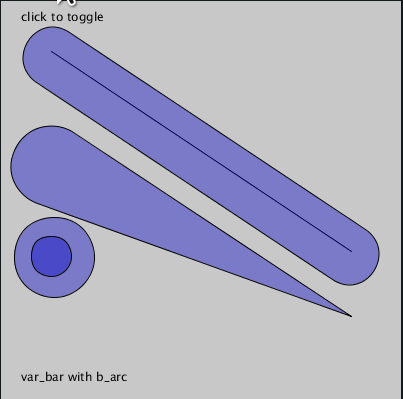

# Arc, tangents & Bezier studies


> from sketch-a-day project, [sketch_2020_09_26a](https://github.com/villares/sketch-a-day/tree/main/2020/sketch_2020_09_26a)

This repository contains the product of my studies trying to work with arcs, bezier approximations of arcs and tangents. Most functions were made initially on Processing Python mode and now work with [py5](http://py5coding.org). Some will work with [pyp5js](berinhard.github.io/pyp5js/) too, and I have ported `b_arc` for Processing Java and p5js. **You are wellcome to help porting more stuff!**

I have added very little new ideas here, you can look at the findings & previous studies I moved into the `PRIOR_ART` folder. I tried to attribute stuff with links. 

Please note that the most recent (and maybe unstable?) version of the Python functions shown here are kept at this other repository: [github.com/villares/villares](https://github.com/villares/villares). You will probably want to get [`arcs.py`](https://github.com/villares/villares/blob/main/arcs.py) and [`line_geometry.py`](https://github.com/villares/villares/blob/main/line_geometry.py) it depends on.

### Bezier approximation of an arc

Processing *PShape* insfrastructure does not contain a fuction for embeding an arc in a larger polyline shape. The `b_arc` function provided here can be used inside `beginShape()`/`endShape()` as a kind of "arcVertex" (which doesn't exist). It follows mostly the Processing `arc` signature, but does not include PIE and CHORD modes. You can find demos at:

- [`b_arc`](/villares_bezier_arc_aproximation/villares_bezier_arc_aproximation.pyde) Processing Python mode (also works with [pyp5js](https://berinhard.github.io/pyp5js) and [py5](http://py5.pixora.io))

- [`b_arc`](/villares_bezier_arc_aproximation_java/villares_bezier_arc_aproximation_java.pde) Processing Java 

- [`b_arc`](/villares_bezier_arc_aproximation_p5js/villares_bezier_arc_aproximation_p5js.js) p5.js
  
  > 
  > 
  > ```python
  > x, y, w, h, start_angle, end_angle = 75, 100, 100, 100, 0, PI + QUARTER_PI
  > # Standalone arc replacement
  > b_arc(x, y, w, h, start_angle, end_angle)
  > 
  > # mode=2 for use inside beginShape/endShape
  > x += 125
  > beginShape()
  > b_arc(x, y, w, h, start_angle, end_angle, mode=2) 
  > endShape(CLOSE)
  > x += 125
  > beginShape()
  > b_arc(x, y, w, h, start_angle, end_angle, mode=2)
  > vertex(x, y)
  > endShape(CLOSE)
  > ```

### More arcs and the first tangents

Other functions based on `b_arc`, and a polygonal approximation called `p_arc`, are kept at [`arcs.py`](https://raw.githubusercontent.com/villares/villares/main/arcs.py).

- The `var_bar` and `bar` functions draw "two connected circles". They can be used with `p_arc`(a polygonal approximation of an arc) instead of the default `b_arc`. 

- The `var_bar_pts` function, based on `arc_pts`, returns the points that `var_bar` would draw with the same arguments (except the `internal` feature). 

- The `arc_pts` function returns a list of points (as tuples), that `p_arc` would draw, but does not draw them. `p_arc` now uses `arc_pts` internally.

  > 
  > 
  > ```python
  > …
  > # default var_bar & bar with b_arc
  > var_bar(50, 165, 350, 315, 40, 0) # by default arc_func=b_arc
  > bar(50, 55, 350, 255, thickness=60, shorter=mouseX)
  > var_bar(50, 255, 50 + mouseX * 0.6, 255 + mouseX * 0.25, 20, 40)
  > … 
  > # var_bar & bar with p_arc
  > var_bar(50, 165, 350, 315, 40, 0, arc_func=p_arc, num_points=6)
  > bar(50, 55, 350, 255, thickness=60,
  >     shorter=mouseX, arc_func=p_arc, num_points=3)
  > var_bar(50, 255,
  >         50 + mouseX * 0.6, 255 + mouseX * 0.25, 20, 40,
  >         arc_func=p_arc, num_points=8)
  > … 
  > # var_bar_pts
  > pts1 = var_bar_pts(50, 165, 350, 315, 40, 0, num_points=6)
  > pts2 = var_bar_pts(50, 55, 350, 255, 30, 30,
  >                    shorter=mouseX, num_points=3)
  > pts3 = var_bar_pts(50, 255,
  >                    50 + mouseX * 0.6, 255 + mouseX * 0.25, 20, 40,
  >                    num_points=8)
  > strokeWeight(5)
  > for px, py in pts1 + pts2 + pts3:
  >     point(px, py)
  > …
  > ```
  > The full code of the Processing Python mode example above is at [villares_arcs_and_bars](villares_arcs_and_bars).

- The same interactive `var_bar` & `var_bar_pts` example above, but [running on the browser](https://abav.lugaralgum.com/arc_tangents_and_bezier_studies/var_bar_pts_pyp5js_example/) using [pyp5js](https://berinhard.github.io/pyp5js)!

- There is a similar, simpler, interactive `var_bar_pts` example using [py5](https://py5coding.org) *imported mode* at [var_bar_pts_py5_example](var_bar_pts_py5_example).

### Filleted polygons and nice shapes that can wrap circles

Perhaps the bigest motivation for starting the studies in this repository, next, we have some functions that povide continous poly-based shapes with tangent arcs. 

- Rounding polygons "in", filleted polygons `arc_filleted_poly`, takes a sequence of points and radii and uses the `arc_corner`function to draw. Notice it may need to make a radius smaller to fit sometimes. A recently added `radius` keyword can be supplied instead of the radius values list.
  
  > 
  > 
  > ```python
  > p_list = [(30, 160), (250, 50), (350, 150), (200, 100)]
  > r_list = [20, 30, 40, 30]
  > …
  > arc_filleted_poly(p_list,r_list)  # arc_func=b_arc by default
  > ```
  > 
  > 
  > 
  > ```python
  > p_list = [(30, 160), (250, 50), (350, 150), (mouseX, mouseY)]
  > r_list = [20, 30, 40, 30]
  > …
  > arc_filleted_poly(p_list,r_list)  # arc_func=b_arc by default
  > ```

- Rounding polygons "outside" with `arc_augmented_poly`, takes a sequence of points and radii and calculates geometry with the `circ_circ_tangent` function. If two points are too close it will reduce the radii.
  
  > 
  > 
  > ```python
  > p_list = [(30, 160), (250, 50), (350, 150), (200, 100)]
  > r_list = [20, 30, 40, 30]
  > …
  > arc_augmented_poly(p_list,r_list)  # arc_func=b_arc by default
  > ```
  > 
  > 
  > 
  > ```python
  > p_list = [(30, 160), (250, 50), (350, 150), (mouseX, mouseY)]
  > r_list = [20, 30, 40, 30]
  > …
  > arc_augmented_poly(p_list,r_list)  # arc_func=b_arc by default
  > ```
  
  - `TO DO:` I should document an "ugly" feature of `arc_augmented_poly` that checks for self intersections calculating a polygonal approximation, without drawing the shapes.
  
  ### A few other silly arc helpers

- The `circle_arc` function tries to create a simpler interface for Processing's `arc`, asking for *x*, *y*, *radius*, *start_angle*, and *sweep* (*radius* instead of *width*, *height* and *sweep* instead of *end_angle*). It also allows drawing with `b_arc` or `p_arc`.
- The `half_circle` and `quarter_circle` are similar, very silly `arc` (or `b_arc`/`p_arc`) wrappers using a mix of Processing constants to define rotation.
  
  > 
  > 
  > ```python
  > x, y, radius, start_angle, sweep = 75, 105, 50, 0, PI + QUARTER_PI
  > circle_arc(x, y, radius, start_angle, sweep)    # default 'arc' wrapper mode
  > circle_arc(x, y, radius, -QUARTER_PI / 2, -HALF_PI, arc_func=p_arc, num_points=4)
  > 
  > x, y1, y2 = 190, 95, 105
  > half_circle(x, y1, radius, TOP, CHORD)  # default 'arc' wrapper mode
  > half_circle(x, y2, radius, BOTTOM, arc_func=b_arc)
  > 
  > x1, x2, y1, y2 = 300, 310, 95, 105
  > quarter_circle(x1, y1, radius, TOP + LEFT, CHORD)  # default 'arc' wrapper mode
  > quarter_circle(x1, y2, radius, BOTTOM + LEFT, PIE)
  > quarter_circle(x2, y1, radius, TOP + RIGHT)
  > quarter_circle(x2, y2, radius, BOTTOM + RIGHT, arc_func=b_arc)
  > ```

- `circle_arc_pts` will return a list of points like the ones `p_arc` would draw.

----

Please open an issue if you have a question. Consider supporting the author, [Alexandre B A Villares](https://abav.lugaralgum.com), at [gumroad.com/villares](https://gumroad.com/villares).
